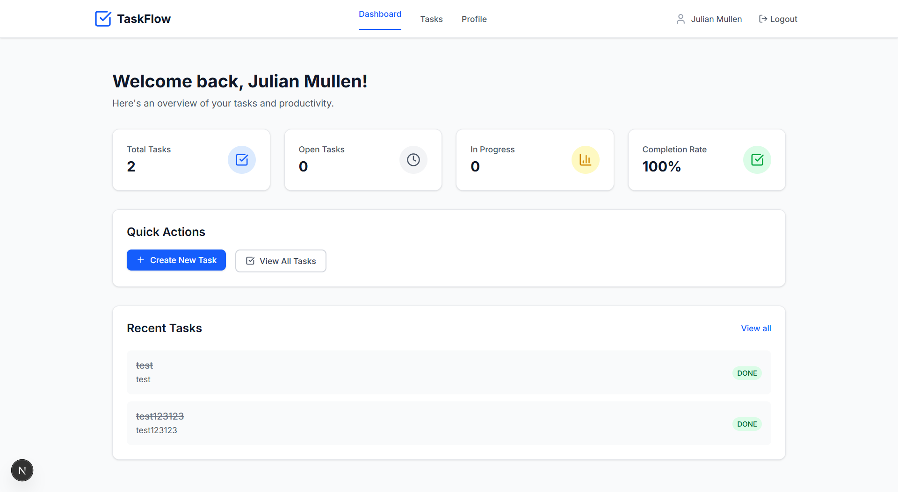
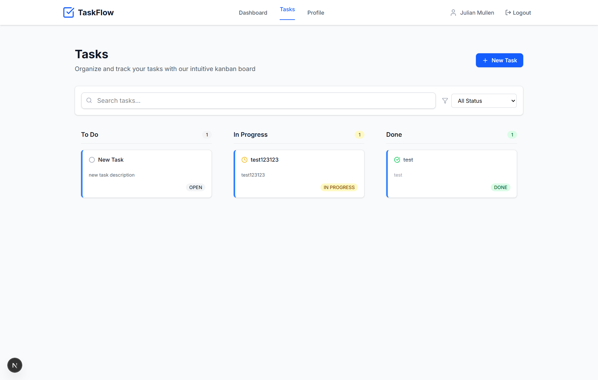
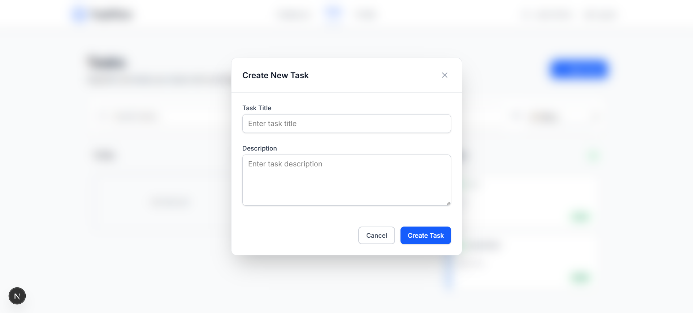
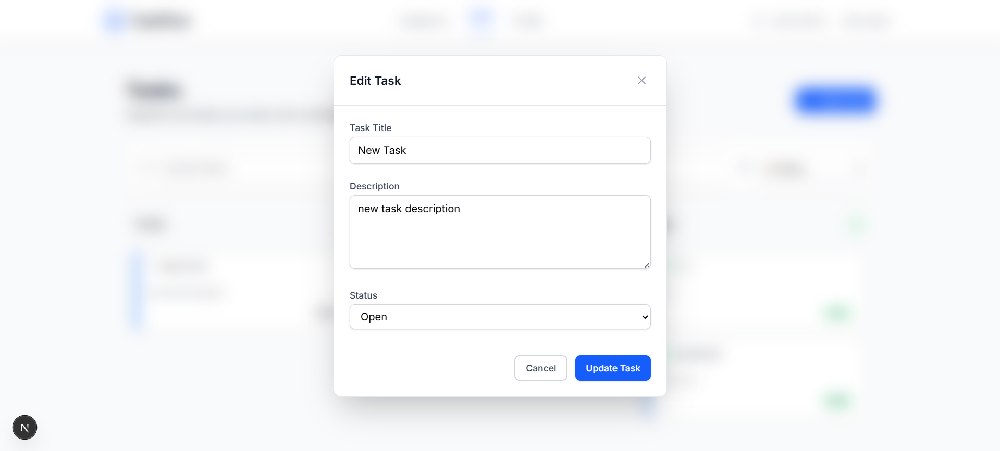
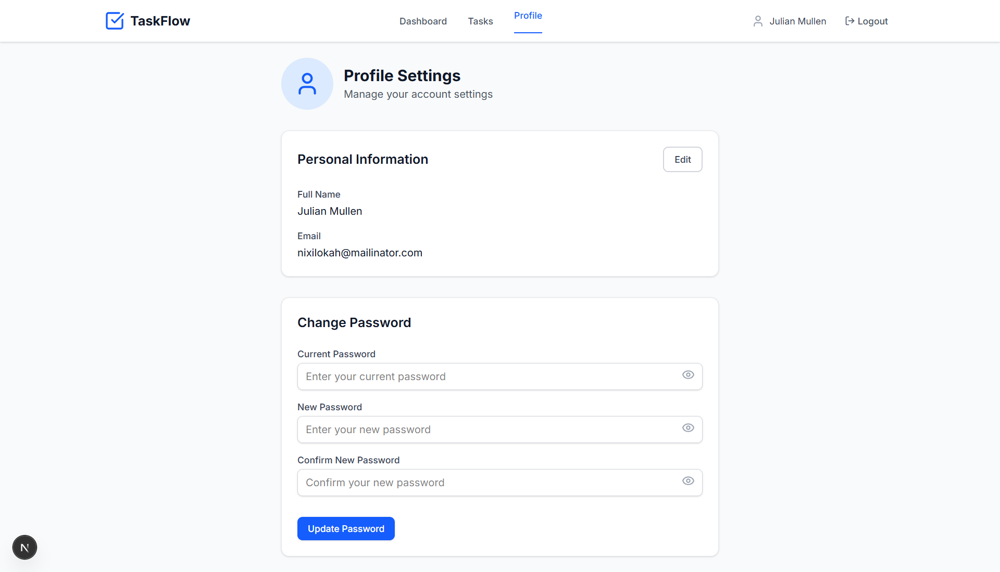
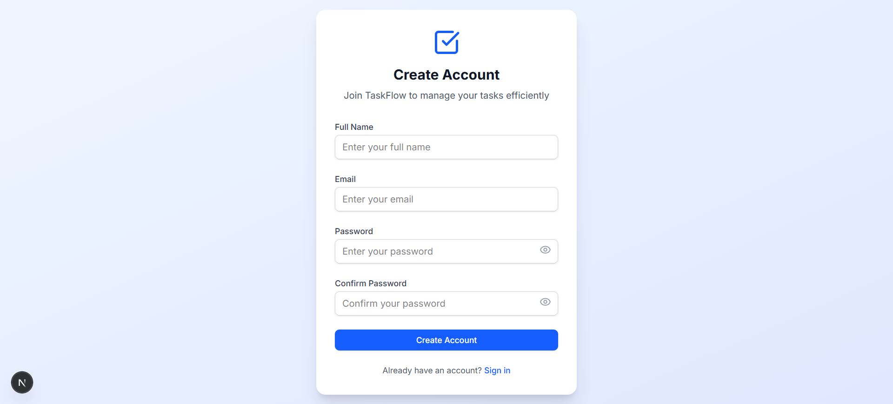
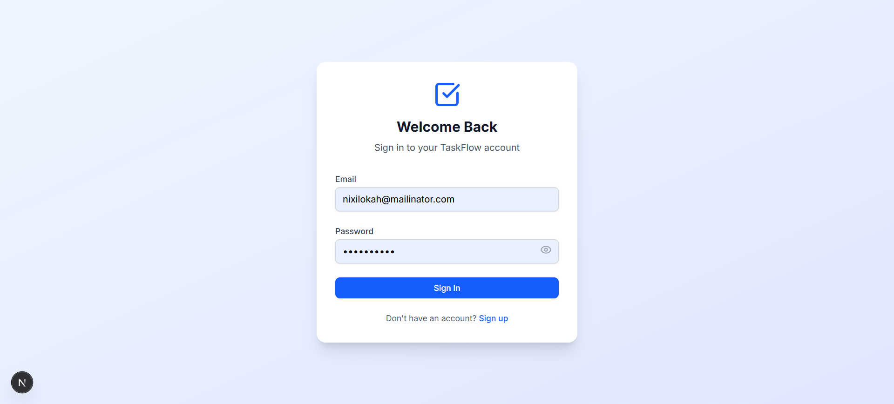

# Task Manager Frontend

A modern, responsive frontend application for task management built with Next.js and TypeScript. This is the frontend companion to the [NestJS Task Manager API](https://github.com/Zbiba42/nest-task-manager).

## 🚀 Features

- **Modern UI**: Clean, responsive design with beautiful animations
- **User Authentication**: Secure JWT-based authentication system
- **Task Management**: Intuitive kanban-style task board
- **Real-time Updates**: Dynamic task status updates
- **Search & Filter**: Advanced task filtering and search capabilities
- **Profile Management**: User profile and password management
- **Mobile Responsive**: Optimized for all screen sizes

## 📸 Screenshots


### Dashboard

*Main dashboard with task statistics and overview*

### Task Management

*Kanban board with task organization*

### Creating a Task

*Task creation modal*

### Updating a Task

*Task editing interface*

### Profile Management

*User profile and settings*

### Sign Up

*User registration page*

### Sign In

*User login page*

## 🛠️ Tech Stack

- **Framework**: Next.js 14 (App Router)
- **Language**: TypeScript
- **Styling**: Tailwind CSS
- **State Management**: Zustand
- **HTTP Client**: Axios
- **Icons**: Lucide React
- **Authentication**: JWT Tokens

## 📦 Installation

```bash
# Install dependencies
npm install

# or
yarn install
```

## 🔧 Environment Variables

Create a `.env` file in the root directory:

```env
NEXT_PUBLIC_API_URL=http://localhost:3000
```

> **Note**: Make sure your [NestJS Task Manager API](https://github.com/Zbiba42/nest-task-manager) is running on the specified URL.

## 🏃 Running the Application

```bash
# Development mode
npm run dev

# or
yarn dev
```

Open [http://localhost:3001](http://localhost:3001) with your browser to see the application.

## 🔗 Backend Integration

This frontend is designed to work with the [NestJS Task Manager API](https://github.com/Zbiba42/nest-task-manager). 

**Backend Repository**: https://github.com/Zbiba42/nest-task-manager

Make sure to:
1. Clone and set up the backend repository
2. Start the backend server on `http://localhost:3000`
3. Update the `NEXT_PUBLIC_API_URL` environment variable if needed

## 📱 Application Structure

```
src/
├── app/                    # Next.js App Router pages
│   ├── (authenticated)/    # Protected routes
│   │   ├── dashboard/      # Dashboard page
│   │   ├── tasks/          # Task management page
│   │   └── profile/        # User profile page
│   └── auth/              # Authentication pages
│       ├── signin/        # Sign in page
│       └── signup/        # Sign up page
├── components/            # Reusable UI components
│   └── ui/               # UI component library
├── lib/                  # Utility functions
│   └── axios.ts          # API client configuration
└── store/               # State management
    ├── auth.store.ts    # Authentication state
    └── tasks.store.ts   # Task management state
```

## 🎨 Key Features

- **User Authentication**: Secure sign up, sign in, and profile management
- **Task Management**: Kanban board with create, update, delete, and status tracking
- **Search & Filter**: Find tasks quickly with advanced filtering options
- **Responsive Design**: Works perfectly on desktop, tablet, and mobile
- **Real-time Updates**: Instant UI updates without page refreshes

## 🔐 Authentication Flow

JWT-based authentication with automatic token management and protected routes.

## 📊 State Management

Zustand stores handle authentication and task data with TypeScript support.

## 🎯 API Integration

Seamless integration with NestJS backend using Axios and JWT authentication.

## 🧪 Available Scripts

```bash
# Start development server
npm run dev

# Build for production
npm run build

# Start production server
npm start

# Run linting
npm run lint
```

## 🔒 Security Features

- **JWT Authentication**: Secure token-based authentication
- **Protected Routes**: Route-level access control
- **Input Validation**: Form validation and sanitization
- **Error Handling**: Graceful error boundaries

## 🎨 UI Components

Comprehensive component library with buttons, inputs, modals, task cards, and forms.

## 📱 Responsive Design

Mobile-friendly design that works perfectly on all screen sizes.


## 🤝 Contributing

1. Fork the repository
2. Create a feature branch (`git checkout -b feature/amazing-feature`)
3. Commit your changes (`git commit -m 'Add some amazing feature'`)
4. Push to the branch (`git push origin feature/amazing-feature`)
5. Open a Pull Request

## 📄 License

This project is licensed under the MIT License.

## 🔗 Related Projects

- **Backend API**: [NestJS Task Manager API](https://github.com/Zbiba42/nest-task-manager) - The backend server for this application

## 🙏 Acknowledgments

- Built with [Next.js](https://nextjs.org/)
- Styled with [Tailwind CSS](https://tailwindcss.com/)
- Icons by [Lucide React](https://lucide.dev/)
- State management with [Zustand](https://zustand-demo.pmnd.rs/)